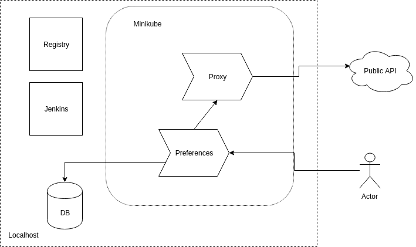

# Docker

## Definição 

Docker é baseado em containers linux (LCX).  É um tipo de virtualização em nível de sistema operacional que proporciona a execução de múltiplas instâncias isoladas de um determinado sistema operacional dentro de um único hospedeiro. 

O conceito é simples e antigo, sendo o comando chroot seu precursor mais famoso. Com o chroot é possível segregar os acessos de diretórios e evitar que o usuário possa ter acesso à estrutura raiz (“/” ou root).

Nada mais é do que um isolar os recursos e as suas aplicações através de uma imagem (template), otimizando deploy, performance, agilidade, entrega e principalmente a forma de como é possível compartilhar todos os recursos sejam eles físicos ou lógicos.

## Docker vs Máquina virutal


Containers não precisam de um sistema operacional completo rodando pois se localizam em cima de um servidor físico e do SO hospedeiro. Cada um deles compartilha o kernel do SO host e costuma partilhar também as bibliotecas e binários.

## Imagem e containers

A imagem é o conceito do que queremos executar e o container é aquela execução especifica da imagem. Fazendo uma analogia com Java ou dotNet, a *imagem* é a *classe* e o *container* é um *objeto* instanciado de cada classe.  

```
$ docker run -p 2012:2012 iundarigun/helloworld
$ docker run -d -p 2012:2012 iundarigun/helloworld
$ docker ps
```
O que aparece no depois do docker ps é o container. A imagem é *iundarigun/helloworld*

Accessar ao http://localhost:2012

Para parar a execução do container:
```
$ docker stop <container_name>
```
E para reexecutar o mesmo container:
```
$ docker start <container_name>
```

As imagens são formadas por camadas, onde cada camada constitui uma porção de elementos que pode ser reusada. 


## Como construir uma imagem

As imagens docker são construidas a partir de um arquivo chamado Dockerfile, que onde definimos as camadas:
```
FROM openjdk:11.0.2-jre-stretch

ENTRYPOINT ["/usr/bin/java", "-jar", "/home/helloworld.jar"]

ADD build/libs/*.jar /home/helloworld.jar
``` 

### Projeto de estudo



O código e algumas instruções estão no seguinte repositório:

https://github.com/iundarigun/workshop-kubernetes

Para rodar o projeto, precisamos de um banco. As instruções para rodar um banco MySql estão no README.md do projeto.

Vamos rodar o projeto preferences:
```
$ cd preferences
$ ./gradlew bootRun
```

Agora precisamos rodar o projeto proxy. 
```
$ cd proxy
$ ./gradlew bootRun
```

Agora só acessar a http://localhost:9009 e deveria estar todo funcionando

## Dockerizando o projeto

Para dockerizar o projeto, temos um Dockerfile em cada projeto para isso. Temos que garantir que o projeto está compilado, então desde cada pasta fazemos:

```
$ ./gradlew clean
$ ./gradlew build
```

Agora podemos gerar a imagem. Ver as instruções no README de cada projeto.

## Rodando as imagens

Vamos rodar as duas imagens:

```
$ docker run -d iundarigun/proxy
$ docker run -d iundarigun/preferences
```
O problema é que não está acessível ainda. Não especificamos a porta. Precisamos fazer isso:

```
$ docker run -d -p 9000:9000 --name workshop-proxy iundarigun/proxy
$ docker run -d -p 9009:9009 --name workshop-preferences iundarigun/preferences
```

Ok, o `proxy` funcionou, mas o preferences não. Vamos tentar ver os logs:

```
$ docker logs -f workshop-preferences
```

Isso é porque tenta pegar a conexão do banco do localhost e ele não entende o que é o localhost.

```
$ docker run -d -p 9009:9009 -e SPRING_DATASOURCE_URL="jdbc:mysql://<YOUR_IP>:3306/preferences?useSSL=false&allowPublicKeyRetrieval=true" --name workshop-preferences iundarigun/preferences
```
Faltou especificar a url do proxy.
```
$ docker run -d -p 9009:9009 -e SPRING_DATASOURCE_URL="jdbc:mysql://<YOUR_IP>:3306/preferences?useSSL=false&allowPublicKeyRetrieval=true" -e URL_PROXY="http://<YOUR_IP>:9000" --name workshop-preferences iundarigun/preferences
```

